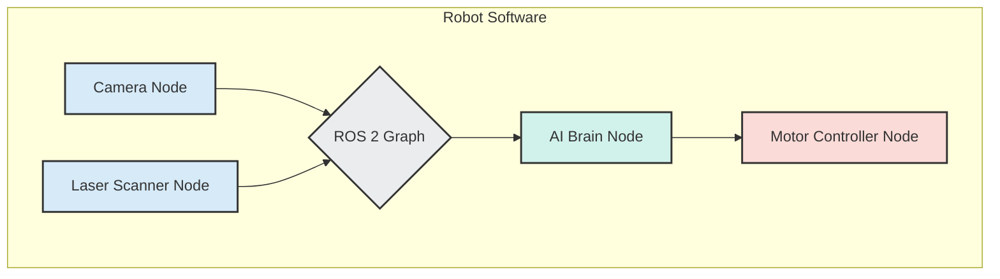

# Introduction to the Robotic Nervous System

Welcome to the world of modern robotics! Before we can make a humanoid robot see, think, or act, we need to build its nervous system. In robotics, the "nervous system" is the complex web of software that allows all the different parts of a robot—its sensors, motors, and brains—to communicate with each other reliably and in real-time.

This is the role of the **Robot Operating System (ROS)**, and specifically its latest iteration, **ROS 2**.

## Why ROS 2?

Imagine trying to build a robot from scratch. You have a camera, a laser scanner, wheels, and a powerful computer for an AI brain. How do you get them all to talk to each other?

- How does the camera feed video to the AI?
- How does the AI tell the wheels to move?
- What happens if one component crashes? Does the whole robot fail?

Without a standardized framework, you would have to write a massive amount of complex, low-level code just to handle this communication. This is often called "plumbing," and it's a huge distraction from the real goal: building intelligent robot behaviors.

ROS 2 solves this problem by providing a standard, modular, and battle-tested set of tools and libraries for robot software development. It is not a traditional operating system like Windows or Linux, but rather a **middleware** that runs on top of an existing OS.

**Key benefits of using ROS 2:**

- **Modularity**: ROS 2 encourages you to break down your robot's software into small, independent programs called **nodes**. A node might be responsible for one specific task, like controlling a motor, reading a sensor, or planning a path.
- **Scalability**: This node-based architecture allows you to build systems that scale from a simple two-wheeled robot to a complex humanoid with hundreds of components.
- **Resilience**: Because the nodes are independent processes, the crash of a non-essential node (like a secondary sensor) doesn't have to bring down the entire robot.
- **Community & Ecosystem**: ROS has a massive global community, which means there are thousands of pre-built packages, drivers, and tools available for you to use.

In this module, we will explore the fundamental concepts of ROS 2 that make it the industry-standard nervous system for today's most advanced robots.

## A High-Level View of ROS 2

Here is a simple conceptual diagram of a ROS 2 system. Don't worry about the details for now; just focus on the idea of independent nodes communicating with each other.

