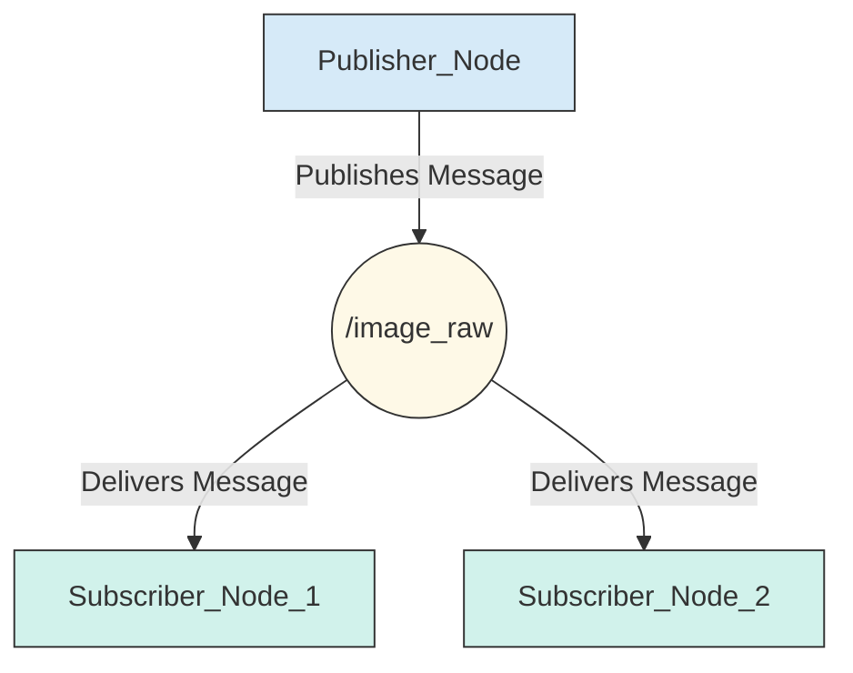
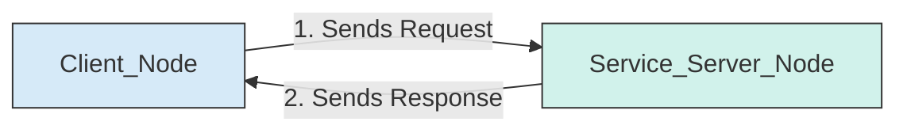
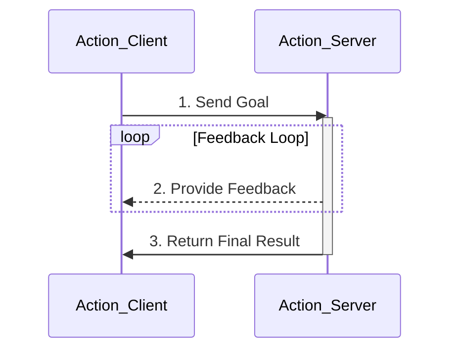

# Core Concepts of ROS 2

ROS 2 is built around a few key concepts that enable its modular and resilient architecture. Understanding these is the key to understanding how any ROS 2-powered robot works.

## 1. Nodes

A **Node** is the fundamental processing unit in ROS 2. Think of it as a small, independent program that is responsible for a single, well-defined task.

-   A node could manage a specific sensor (e.g., `camera_node`).
-   A node could control a specific actuator (e.g., `left_wheel_motor_node`).
-   A node could perform a specific computation (e.g., `path_planning_node`).

By breaking a complex robotic system down into many small nodes, the system becomes easier to understand, debug, and scale.

## 2. Topics (Publisher/Subscriber)

**Topics** are the primary mechanism for one-way, continuous communication. They are named buses over which nodes can send and receive data.

-   **Publishers**: A node that *sends* data to a topic is called a publisher.
-   **Subscribers**: A node that *receives* data from a topic is called a subscriber.

This is a **many-to-many** communication system. One topic can have multiple publishers and multiple subscribers. It's perfect for streaming data, such as sensor readings, robot state, or commands.

**Use Case**: A `camera_node` continuously publishes images to an `/image_raw` topic. An `image_processor_node` and a `data_recorder_node` can both subscribe to this same topic to receive the images simultaneously.

## 3. Services (Client/Server)

**Services** are used for two-way, request/response communication. Unlike topics, services are designed for transactions that are expected to complete quickly.

-   **Service Server**: A node that offers a service and waits for a request. When it receives one, it performs a task and sends back a single response.
-   **Service Client**: A node that sends a request to a service and waits for the response.

This is a **one-to-one** communication system. It's ideal for tasks like "get the robot's current position" or "calculate the inverse kinematics for this arm position."

**Use Case**: A `navigation_node` provides a `/clear_costmaps` service. When an operator wants to clear the robot's map of obstacles, a separate `operator_tool_node` can call this service as a client. The service performs the action and returns a success/failure response.

## 4. Actions (Action Client/Action Server)

**Actions** are designed for long-running, feedback-driven tasks. They are similar to services, but they provide a crucial additional feature: they can provide feedback on their progress and can be canceled while they are running.

-   **Action Server**: A node that accepts a "goal" for a long-running task. It periodically provides feedback on its progress and sends a final result when the task is complete.
-   **Action Client**: A node that sends a goal to an Action Server. It can receive the periodic feedback and the final result. It can also request to cancel the goal.

**Use Case**: Navigating a robot to a specific point is a classic example. An `application_node` can send a goal (the target coordinates) to a `navigate_to_pose` action server. The server will start moving the robot, provide feedback (e.g., "distance to goal: 5.2 meters"), and finally return a result indicating whether the robot reached its destination. The client can cancel the navigation goal at any time.

## Communication Patterns at a Glance

### Topic

### Service

### Action

## Edge Cases and Resilience

The distributed nature of ROS 2 provides a high degree of resilience. Here are a couple of common scenarios:

### What happens if a node crashes?

Because nodes are independent processes, the crash of one node does not automatically bring down the entire system. If your `camera_node` crashes, the rest of your nodes (like the `motor_controller_node` and `path_planning_node`) will continue to run.

Any other nodes that were subscribed to the camera's topics will simply stop receiving new messages. Depending on how those nodes are written, they might continue to function with old data, or they might enter a "waiting" state. ROS 2 also provides tools like "lifecycles" that allow you to design nodes that can be gracefully shut down, restarted, and managed, further increasing the robustness of your system.

### What happens if a message is published but no one is listening?

Nothing! The publisher simply sends the message out onto the ROS 2 graph. If there are no subscribers on that topic, the message effectively goes nowhere. This is a key feature of the decoupled nature of topics. It allows you to add and remove nodes (like a data recorder or a visualization tool) to your system dynamically without having to reconfigure or restart the existing nodes.

