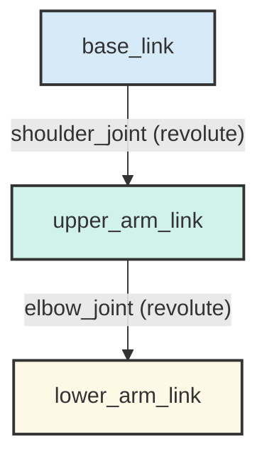

# Modeling a Humanoid Robot with URDF

While ROS 2 provides the nervous system for our robot, we still need a way to describe its physical body. What does it look like? How are its limbs connected? How do they move?

This is where the **Unified Robot Description Format (URDF)** comes in. URDF is an XML-based file format used in ROS to describe all the physical elements of a robot. It is the standard way to represent a robot's model.

## The Core Components of URDF

A URDF file describes a robot as a tree of **links** connected by **joints**.

### 1. Links

A **link** is a rigid part of the robot that is assumed to not bend or change shape. Examples of links include:
- The torso of a humanoid.
- An upper arm.
- A gripper finger.
- A wheel.

Each link has its own coordinate frame and can have properties like `visual` (what it looks like), `collision` (its collision geometry for physics simulation), and `inertial` (its mass and rotational inertia).

### 2. Joints

A **joint** connects two links together and defines how they can move relative to each other. Every joint has a `parent` link and a `child` link, which is how the tree structure is formed.

There are several types of joints, but the most common are:

-   **`revolute`**: A hinge joint that rotates around a single axis, like an elbow or a wheel axle. It has defined upper and lower angle limits.
-   **`continuous`**: A revolute joint with no angle limits, allowing it to spin freely.
-   **`prismatic`**: A sliding joint that moves along a single axis, like a piston. It has defined upper and lower position limits.
-   **`fixed`**: A joint that does not allow any movement. It is used to rigidly connect two links together, which can be useful for simplifying a model or adding sensors.

By defining a series of links and the joints that connect them, you can create a complete **kinematic chain**, representing everything from a simple two-link arm to a full humanoid robot with dozens of degrees of freedom. This URDF model is then used by many different parts of the ROS 2 ecosystem, including simulators, visualization tools, and motion planning libraries.

### Example: A Simple Two-Link Arm

Here is a conceptual URDF snippet for a very simple arm with a base, an upper arm, and a lower arm.

```xml
<?xml version="1.0"?>
<robot name="simple_arm">

  <!-- A fixed base link -->
  <link name="base_link">
    <visual>
      <geometry>
        <cylinder length="0.05" radius="0.1"/>
      </geometry>
    </visual>
  </link>

  <!-- The first moving link (upper arm) -->
  <link name="upper_arm_link">
    <visual>
      <geometry>
        <box size="0.5 0.1 0.1"/>
      </geometry>
    </visual>
  </link>

  <!-- The "shoulder" joint connecting the base to the upper arm -->
  <joint name="shoulder_joint" type="revolute">
    <parent link="base_link"/>
    <child link="upper_arm_link"/>
    <origin xyz="0 0 0.025"/>
    <axis xyz="0 1 0"/>
    <limit lower="-1.57" upper="1.57" effort="1000.0" velocity="0.5"/>
  </joint>

  <!-- The second moving link (lower arm) -->
  <link name="lower_arm_link">
    <visual>
      <geometry>
        <box size="0.4 0.08 0.08"/>
      </geometry>
    </visual>
  </link>

  <!-- The "elbow" joint connecting the upper arm to the lower arm -->
  <joint name="elbow_joint" type="revolute">
    <parent link="upper_arm_link"/>
    <child link="lower_arm_link"/>
    <origin xyz="0.5 0 0"/>
    <axis xyz="0 1 0"/>
    <limit lower="0" upper="1.57" effort="1000.0" velocity="0.5"/>
  </joint>

</robot>
```
Even from this simple example, you can see how the `parent`-`child` relationship in the joints creates a chain from the `base_link` to the `upper_arm_link` and then to the `lower_arm_link`.

### Visualizing the Kinematic Chain

The structure created by the links and joints is called a kinematic chain. Here is a diagram representing the simple arm from the URDF snippet above:


This chain is the fundamental data structure used for all robot motion planning.


