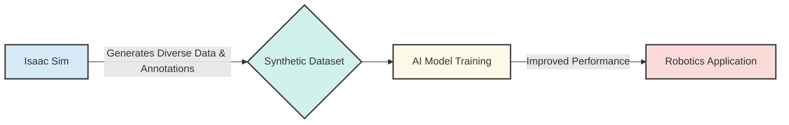

# NVIDIA Isaac Sim: Overview, Photorealistic Simulation and Synthetic Data

Welcome to Module 3, where we delve into the "brain" of our AI-powered humanoid robot. Before a robot can interact intelligently with the real world, it needs to perceive, understand, and navigate its environment. This module focuses on NVIDIA's Isaac platform, a powerful suite of tools designed to accelerate robotics development, especially for AI applications.

## NVIDIA Isaac Sim: The Virtual World for Robots

**NVIDIA Isaac Sim** is a robotics simulation and synthetic data generation platform built on NVIDIA Omniverse. It provides a highly realistic, physically accurate, and extensible virtual environment where robots can be developed, tested, and trained. Think of it as a digital twin for robot training and experimentation.

### Photorealistic Simulation

Why is "photorealistic" important for robotics? For AI models that learn from visual data (like a robot's cameras), the quality and realism of the training environment directly impact the model's performance in the real world. Isaac Sim creates stunningly realistic virtual worlds with:

-   **Accurate Physics**: Simulating gravity, collisions, friction, and fluid dynamics using the NVIDIA PhysX engine.
-   **Advanced Rendering**: Ray tracing and path tracing capabilities enable realistic lighting, shadows, and reflections. This ensures that what the virtual camera "sees" is very close to what a real camera would see.
-   **Diverse Environments**: Easily create factories, warehouses, homes, and outdoor scenes with a vast library of assets.

This level of realism helps bridge the **sim-to-real gap**, meaning that models trained in simulation are more likely to perform well when deployed on physical robots.

### Synthetic Data Generation (SDG)

One of Isaac Sim's most powerful features is its ability to generate **synthetic data**. Collecting and annotating real-world data for AI training is incredibly time-consuming, expensive, and often dangerous. Synthetic data provides an efficient alternative:

-   **Automated Annotation**: Isaac Sim can automatically generate ground truth labels for every pixel, object pose, depth information, and more. This eliminates the need for manual annotation, which is a major bottleneck in AI development.
-   **Infinite Variety**: You can easily vary parameters like lighting conditions, object textures, robot configurations, and environmental layouts to create vast and diverse datasets. This robustness helps AI models generalize better to unseen real-world scenarios.
-   **Edge Case Generation**: It's difficult to collect data for rare or dangerous edge cases in the real world. Isaac Sim allows you to programmatically create these scenarios (e.g., objects falling, sudden obstacles) to make your AI models more resilient.

Synthetic data generated by Isaac Sim is a game-changer for training robust perception, manipulation, and navigation models for humanoid robots. It allows developers to rapidly iterate and improve their AI without the logistical challenges of real-world data collection.

## Synthetic Data Generation Pipeline

