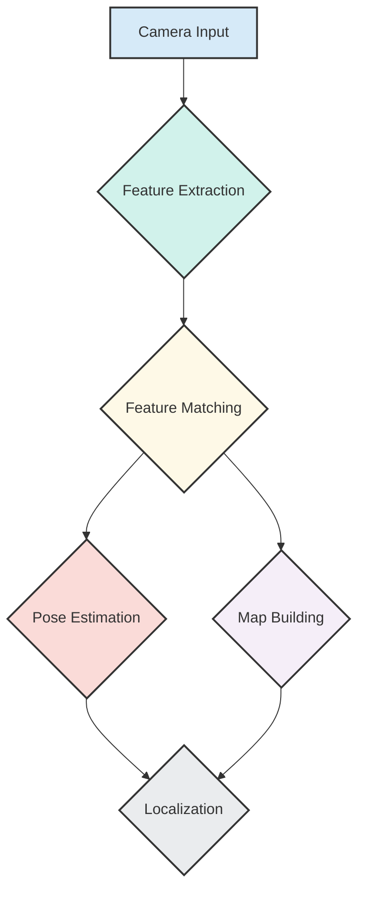

# NVIDIA Isaac ROS and Visual SLAM (VSLAM)

Building on the foundation of Isaac Sim's virtual worlds, we now turn our attention to how our robot brain processes real-time sensor data to understand its environment. This is where **NVIDIA Isaac ROS** comes into play, offering GPU-accelerated modules to power the robot's perception pipeline.

## NVIDIA Isaac ROS: Accelerating the Perception Pipeline

Just as Isaac Sim provides the data, **NVIDIA Isaac ROS** provides the high-performance computing necessary to process that data efficiently. Isaac ROS is a collection of ROS 2 packages that leverage NVIDIA GPUs to deliver accelerated performance for critical robotics workloads, particularly in perception.

Key aspects of Isaac ROS:
-   **GPU Acceleration**: Many fundamental robotics algorithms (e.g., image processing, point cloud operations, feature detection) are computationally intensive. Isaac ROS re-implements these algorithms to run efficiently on NVIDIA GPUs, leading to significantly faster processing times.
-   **Optimized ROS 2 Integration**: Isaac ROS packages are designed to integrate seamlessly with the ROS 2 ecosystem, providing standard ROS 2 interfaces while harnessing the power of specialized NVIDIA hardware.
-   **Rich Set of Primitives**: It includes a variety of modules for tasks such as:
    -   Sensor processing (e.g., rectification, depth estimation).
    -   Feature detection and tracking.
    -   Object detection and classification (often integrating with deep learning frameworks).

The speed and efficiency provided by Isaac ROS are crucial for humanoid robots that need to perceive and react to their environment in real-time.

## Visual SLAM (VSLAM): The Robot's Eye-Mapper

One of the most critical perception tasks for any autonomous robot is **Simultaneous Localization and Mapping (SLAM)**. This is the problem of building a map of an unknown environment while simultaneously keeping track of the robot's location within that map. When SLAM is performed primarily using visual data from cameras, it's called **Visual SLAM (VSLAM)**.

VSLAM is fundamental for:
-   **Autonomous Navigation**: A robot needs to know where it is and what its surroundings look like to move safely and efficiently.
-   **Object Interaction**: Understanding the spatial relationship between the robot and objects in its environment.

How VSLAM generally works:
1.  **Feature Extraction**: The robot's camera captures images. Key features (e.g., corners, edges, distinct patterns) are extracted from these images.
2.  **Feature Matching**: These features are then tracked across successive image frames.
3.  **Pose Estimation**: By observing how the features move, the VSLAM algorithm can estimate the robot's own movement (its "pose" – position and orientation).
4.  **Map Building**: Concurrently, these tracked features are used to build a sparse or dense map of the environment.

Isaac ROS provides accelerated components that are vital for making VSLAM pipelines run at the high frame rates and low latencies required for real-time humanoid robot operation. This allows our robot brain to continuously update its understanding of the world, even in dynamic environments.

## Visual SLAM Pipeline

## Edge Case: Handling Sensor Noise in VSLAM

Real-world sensors are never perfect; they always introduce some level of noise into the data. In VSLAM, sensor noise (e.g., grainy images, inaccurate pixel values) can lead to:

-   **Incorrect Feature Extraction**: Noise can obscure real features or create spurious ones.
-   **Poor Feature Matching**: It becomes harder to accurately track features across frames.
-   **Drift in Pose Estimation**: Small errors accumulate over time, leading to the robot's estimated position drifting from its true position.
-   **Inaccurate Maps**: The map built by VSLAM can become distorted or contain ghost objects.

To mitigate sensor noise, VSLAM algorithms employ several techniques:

-   **Filtering**: Using statistical filters (like Kalman filters or Particle filters) to smooth sensor data and combine information from multiple sources over time.
-   **Robust Estimation**: Algorithms are designed to be less sensitive to outliers (noisy data points) by using techniques like RANSAC (Random Sample Consensus).
-   **Loop Closure Detection**: When the robot revisits a previously mapped area, VSLAM algorithms can recognize this "loop" and correct accumulated errors, significantly improving the global consistency of the map and localization.

The robust design of VSLAM algorithms, often combined with complementary sensor data (like IMUs), helps the robot brain maintain an accurate understanding of its world even in the presence of imperfect sensor inputs.