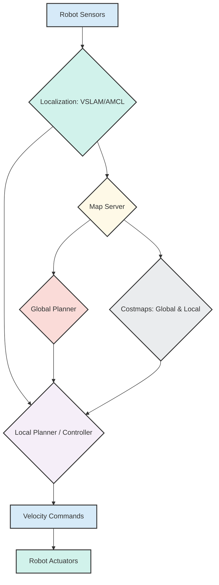

# Nav2 for Humanoid Robots

With our robot now capable of perceiving its environment through Isaac ROS and VSLAM, the next critical step for any autonomous robot is to be able to move intelligently from one point to another. This is the domain of navigation, and in the ROS 2 ecosystem, the standard solution is the **Nav2 stack**.

## What is Nav2?

**Nav2 (Navigation2)** is the ROS 2 successor to the original ROS Navigation Stack. It is a powerful, configurable, and extensible framework for enabling autonomous navigation in mobile robots. While originally designed for wheeled robots, its modular architecture makes it adaptable for more complex platforms like humanoids.

Nav2 typically involves several key components working together:

1.  **Map Server**: Manages the environmental map (e.g., an occupancy grid built by VSLAM or a pre-existing map).
2.  **AMCL (Adaptive Monte Carlo Localization)**: A localization algorithm that estimates the robot's pose within a known map. (While VSLAM also provides localization, AMCL can be used in different scenarios or to refine VSLAM's output).
3.  **Global Planner**: Given the robot's current position and a goal position, the global planner computes a collision-free path from start to goal across the entire map. This path is typically optimal (e.g., shortest or fastest).
4.  **Local Planner / Controller**: This component takes the global path and the robot's current pose, and generates short-term velocity commands to follow the global path while avoiding dynamic obstacles and staying within the robot's movement capabilities.
5.  **Costmaps**: These are grid maps that store information about obstacles in the environment. There are typically two costmaps:
    -   **Global Costmap**: Based on the static map and represents known obstacles.
    -   **Local Costmap**: Built from live sensor data and represents dynamic or recently detected obstacles.
6.  **Recovery Behaviors**: What happens if the robot gets stuck or deviates too far from its path? Nav2 includes recovery behaviors (e.g., rotating in place, backing up) to attempt to free the robot or return it to a valid state.

## Nav2 for Bipedal Humanoids

Adapting Nav2 for bipedal humanoids presents unique challenges compared to wheeled robots:

-   **Kinematic Constraints**: Humanoids have complex, high-degree-of-freedom kinematics. Their movement is not simply about turning wheels but involves coordinated joint movements for walking, balancing, and manipulating.
-   **Balance and Stability**: Maintaining balance is paramount. Nav2's local planners need to integrate with whole-body control and balance algorithms to ensure the robot doesn't fall.
-   **Dynamic Environments**: Human environments are often dynamic. Nav2's ability to handle moving obstacles is crucial.

Despite these challenges, Nav2's modularity allows for the integration of specialized bipedal walking controllers and planners that can utilize Nav2's robust framework for global path planning and local obstacle avoidance. This means our AI-robot brain can leverage existing, battle-tested navigation solutions, adapting them to the unique locomotion of a humanoid form.

## Nav2 Stack High-Level Architecture

## Edge Cases: Challenges and Recovery in Humanoid Navigation

Navigating complex environments with a humanoid robot introduces several challenges that the AI brain and Nav2 stack must address.

### Dynamic Environments

Unlike static warehouse environments, human spaces are often dynamic. People move, objects are rearranged, and lighting changes.

-   **Moving Obstacles**: Humanoids need to detect and predict the movement of dynamic obstacles (people, other robots) and adjust their paths in real-time. Nav2's local planners are crucial here, often using sophisticated algorithms to react quickly.
-   **Changing Maps**: Long-term changes in the environment (e.g., furniture rearrangement) require map updates or re-localization. VSLAM and global planning must be robust to these changes.

### Navigation Failures and Recovery

Despite the best planning, robots can still encounter situations where they get stuck, deviate too far, or face unexpected obstacles.

-   **Getting Stuck**: A robot might misjudge a gap, trip, or get entangled. Nav2's **Recovery Behaviors** are designed for these scenarios. They might involve:
    -   **Backing Up**: Attempting to reverse out of a tight spot.
    -   **Spinning in Place**: To clear local obstacles or re-localize.
    -   **Global Path Recalculation**: If local recovery fails, a new global path might be needed.
-   **Maintaining Balance**: For bipedal robots, a navigation failure can also mean a loss of balance, leading to a fall. Advanced humanoid control systems must integrate closely with Nav2 to ensure stability during motion and recovery, potentially triggering specialized balance recovery maneuvers.
-   **Human Intervention**: In critical situations, the robot must be able to signal for human assistance or safely shut down to prevent damage.

By understanding and robustly addressing these edge cases, the AI brain can enable a humanoid robot to navigate autonomously and reliably in the real world.