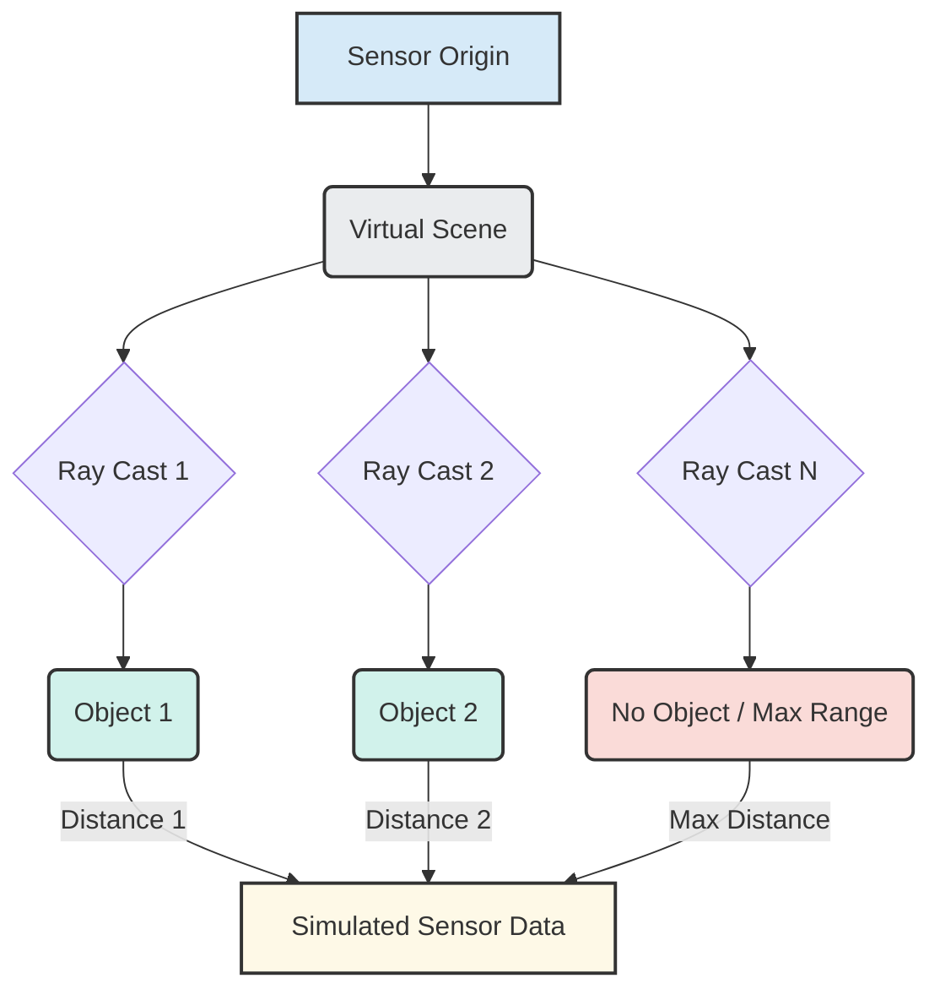

# Core Simulation Concepts: Physics, Collisions, and Sensors

To create a believable and useful Digital Twin, a simulation environment must accurately model how a robot interacts with its physical world. This involves understanding core concepts like physics, collisions, and how sensors perceive the virtual environment.

## Physics Simulation: Bringing the World to Life

Physics engines are the heart of any realistic simulator. They are software modules that calculate the movement and interaction of objects in a virtual world based on the laws of physics.

### 1. Gravity

Just like in the real world, simulated objects are affected by gravity. The physics engine applies a constant downward force to all objects, making them fall unless supported. This is fundamental for modeling a robot's balance and gait.

### 2. Rigid Body Dynamics

Robots are typically composed of **rigid bodies**—parts that do not deform under stress. Physics engines simulate the motion of these rigid bodies, taking into account:
-   **Mass and Inertia**: How heavy an object is and how resistant it is to changes in its state of motion.
-   **Forces and Torques**: External influences (like motor commands) that cause objects to accelerate or rotate.
-   **Joint Constraints**: How different rigid bodies (links) are connected by joints, limiting their relative motion (as defined in URDF, for example).

### 3. Collisions

Accurate collision detection and response are critical. When two simulated objects occupy the same space, the physics engine:
-   **Detects Collision**: Identifies when the geometries of two objects overlap.
-   **Calculates Contact Forces**: Determines the forces that prevent objects from passing through each other.
-   **Resolves Collision**: Applies these forces to push the objects apart and prevent interpenetration, often accounting for material properties like elasticity and friction.

Without proper collision handling, robots would simply pass through obstacles or fall through the floor, making any meaningful interaction impossible.

## Simulated Sensors: A Robot's Virtual Eyes and Ears

For a robot to perceive and understand its environment, whether real or virtual, it relies on sensors. Simulators provide virtual counterparts to these real-world devices, generating data that mimics what a physical sensor would output.

### 1. LiDAR (Light Detection and Ranging)

-   **Real World**: Emits laser pulses and measures the time it takes for them to return, creating a 3D map of the environment (a point cloud).
-   **Simulation**: The simulator performs "ray casting" into the virtual scene. For each laser beam, it calculates the distance to the first object it intersects. These distances are then assembled into a simulated point cloud.

### 2. Depth Cameras (e.g., RGB-D Cameras like RealSense, Kinect)

-   **Real World**: Capture both a color image (RGB) and a depth map (D), where each pixel indicates the distance to the object it represents.
-   **Simulation**: For each pixel in the virtual camera's view, the simulator calculates the distance to the nearest object. This information, combined with the rendered color image, forms the simulated RGB-D output.

### 3. IMUs (Inertial Measurement Units)

-   **Real World**: Measure linear acceleration and angular velocity using accelerometers and gyroscopes.
-   **Simulation**: The physics engine directly provides the simulated robot's linear and angular velocities and accelerations. These values are then processed (and often noise is added) to mimic the output of a real IMU.

The goal of simulated sensors is not just to provide data, but to provide *realistic* data, including noise, distortions, and limitations that would be present in a physical sensor. This ensures that perception algorithms developed in simulation are robust enough to work when transferred to the real robot.

### Conceptual: Ray Casting for Simulated Sensors

## Bridging the Gap: Sim-to-Real Transfer

One of the biggest challenges in robotics is reliably transferring algorithms and behaviors developed in simulation to a physical robot. This is known as the **sim-to-real gap**. While simulators strive for realism, there are always discrepancies ("reality gap") that can cause algorithms to perform differently in the real world.

Strategies to address the sim-to-real gap include:
-   **Domain Randomization**: Training AI models in simulations where various parameters (e.g., textures, lighting, object positions, physics properties) are randomized. This forces the model to learn more robust features that generalize better to the real world.
-   **System Identification**: Using data from the real robot to fine-tune and improve the accuracy of the simulated robot's physics and sensor models.
-   **Fidelity Tuning**: Adjusting the level of detail and accuracy in the simulation. Sometimes, a less physically accurate but faster simulation is better for rapid iteration, while a higher-fidelity simulation is used for final validation.

## Simulation Time vs. Real Time

In simulation, there's an important distinction between **simulation time** and **real time**:

-   **Real Time**: This is the actual time passing in the physical world, measured by a clock.
-   **Simulation Time**: This is the time passing within the simulated world.

Often, a simulation might run **faster than real time** (e.g., to speed up training or data generation) or **slower than real time** (if the computations are very intensive). For testing algorithms that require real-time interaction (like a robot balancing), the simulation must be able to run in real time or faster. However, for many planning or perception tasks, running faster than real time can significantly accelerate development. Simulators typically provide tools to manage and synchronize these two time domains.