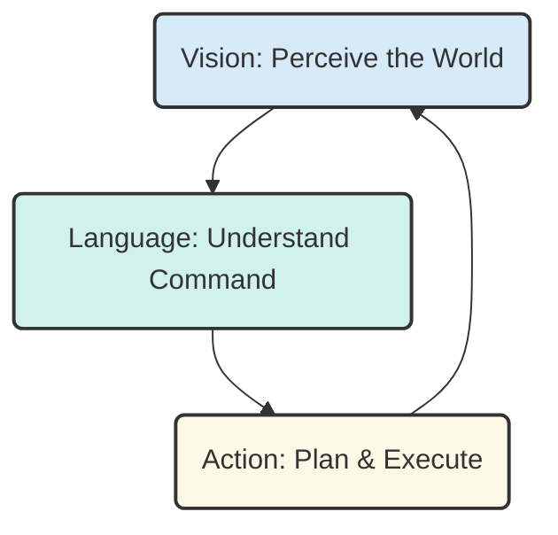

# Introduction to Vision-Language-Action (VLA)

Welcome to Module 4, the capstone of our journey into humanoid robotics. In the previous modules, we have laid the groundwork:
-   **Module 1**: We built the robot's **nervous system** with ROS 2, enabling communication between all its components.
-   **Module 2**: We created a **Digital Twin**, a virtual environment for safe testing and development.
-   **Module 3**: We assembled the **AI Brain**, giving our robot the ability to perceive and navigate its world using advanced tools like NVIDIA Isaac.

Now, we will bring all these pieces together to create a truly intelligent, interactive system: a **Vision-Language-Action (VLA)** loop.

## What is a VLA Loop?

A Vision-Language-Action loop is an architecture that enables a robot or AI agent to perform tasks based on natural language instructions. It represents a fundamental cycle of embodied intelligence:

1.  **Vision**: The robot perceives the world through its sensors, primarily its cameras, to understand the state of its environment and the objects within it.
2.  **Language**: The robot takes a high-level command from a human, typically in the form of spoken language (e.g., "Can you please grab my water bottle?").
3.  **Action**: The robot translates the language command into a series of physical actions and then executes them to achieve the goal.

This loop—from seeing, to understanding, to acting—is the cornerstone of creating robots that can collaborate with humans in a natural and intuitive way. It's what separates a pre-programmed industrial arm from a truly autonomous humanoid assistant.

In this module, we will explore the conceptual architecture of a VLA pipeline, showing how it integrates all the technologies we have learned about so far to bring our humanoid robot to life.

## The VLA Loop

